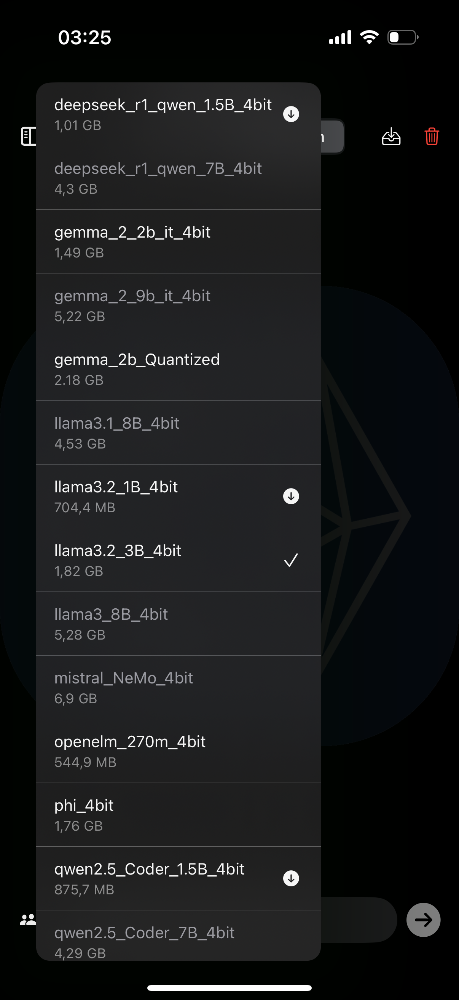
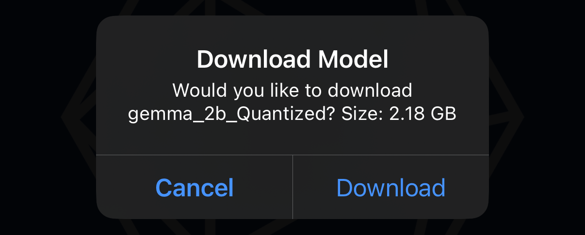
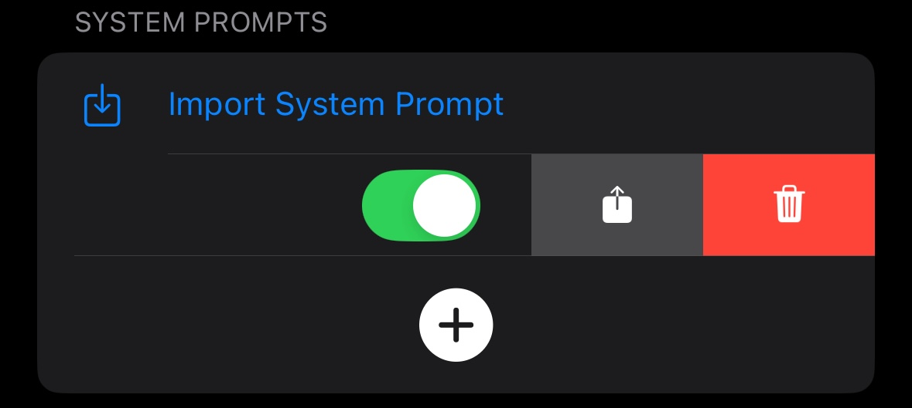

# NetGesucht AI - User Guide

NetGesucht AI is an innovative app that puts the power of local AI models in the palm of your hand. By leveraging Apple's native technology, our app delivers a seamless and secure experience for users who want to harness the potential of LLMs without compromising their data or performance.

In this quick user guide, we will walk you through the available features.

Enjoy.

## Chat (Conversations)

### Selecting Model to Download and Activate

Tap the button to display the menu

A list of available models will appear.

Depending on the amount of available memory, the app will enable you to select and download only the models that fit in your device’s memory; the others will be grayed out.

The currently selected model is indicated with a checkmark.

Downloaded models are marked with a downward arrow.

If you select a model that has not yet been downloaded, the app will prompt you to download it.

### Save Conversation

Conversations are not saved automatically; you must manually save them and assign a name.

### Clean Conversation

You can clear the conversation canvas.

## Configuration

### Device Information

**IP Address:** Use this address to connect to your device when the API Server is enabled.

### Settings

#### Function Calling

When enabled, this feature uses the Llama 3.2 3B model—the only model with robust function calling support.  
Please note that its performance depends on the prompt as well as the script’s name, description, and argument details.

#### API Server

When enabled, you can connect to the device on the assigned port (default: 11434).

It is compatible with the Ollama API as documented by Ollama and works with the official Python library.

**Endpoints:**

- `/` (returns "Ollama is running")
- `/api/generate`
- `/api/chat`
- `/api/tags`

_Note:_ Some apps do not implement their clients following the official protocol description; however, several have been implemented.

The API Server also provides very basic support for the following OpenAI API endpoints:

- `/v1/models`
- `/v1/chat/completions`
- `/v1/embeddings`

#### System Prompts

When enabled, the active System Prompt will be used.

#### Debug Mode

There are two logs: an application debug log containing all application sessions, and an application session log.

When enabled, the debug window in the Agent Workflow canvas remains visible, displaying the application session from launch onward.

The application log can be exported; deleting it will remove both logs.

### Downloaded Models

A list of the models that have been downloaded.

You can delete these models by swiping left.

### Saved Conversations

These are the conversations saved in the Chat view.  
You can remove a conversation by swiping left and tapping the red trash icon.

### System Prompts

System Prompts are used to guide the models to assume a specific persona or behavior.  
It is recommended to always enable a System Prompt to ensure the chat behaves as intended.  
For experimental models like DeepSeek R1, a System Prompt is required.

To add a new System Prompt, press the **+** button.

Tapping an existing System Prompt allows you to edit it.

You can also import, export, and delete System Prompts.

For example, a System Prompt can be used for sentiment analysis, which is especially powerful when combined with agents.

Add a System Prompt for sentiment analysis:

The model should then provide responses similar to the following:

Taking the time to learn prompt engineering will greatly enhance the effectiveness of your System Prompts.

### Scripts - Function Calling Tools

NetGesucht AI allows you to develop your own JavaScript scripts. When Function Calling is enabled in Settings, these scripts are passed to models that support function calling. This enables a model to use your scripts as tools when it deems necessary to generate a response.

_Important:_

- *ONLY LLAMA 3.2 3B* produces good results (although it may not always work flawlessly).
- Only one function call at a time is supported.
- The script name and the function name *must* be identical.

**Adding a New Script**

Enter the script name—it must match exactly the entrypoint function name. It is recommended that the function name alone clearly describes its purpose.

The minimum requirements for a script are:

- Script name
- Description
- Code

If the entrypoint function requires arguments, add them:

- Property name (argument name)
- Valid argument types: string, number, boolean, and array
- Description
- Remember to mark them as 'required' if necessary

By tapping on an existing script, you can edit it.

This allows you to change, remove, or add parameter definitions.

You can also import, export, and delete scripts.

### The following examples show the difference when using function calling

**Without Function Calling**

**With Function Calling**

In this example, a script that retrieves today's date is used, and the model utilizes the tool accordingly.

Then, it returns the information acquired using the tool.

## Agent Workflows

You can access Agent Workflows by tapping the following icon:

### Canvas

### Quick how-to

Create a new workflow by tapping the three dots to open the menu, then select **Create New Workflow**.

Provide a name for your workflow.

Upon creating a new workflow, a **Start** node and an **End** node will be automatically added. There should only be one of each.

You can add additional nodes by tapping the **+** icon and then adding **Agent** and **Tool** nodes.

The newly added node will appear on the canvas.

Tap the **Tool** node to edit it. Assign it a name.

Select a tool by tapping on it; a checkmark will indicate your selection.

If the tool requires parameters, fields will appear for you to fill in.

Select the output connection, which determines where the flow continues after the node completes its operation. In this example, it is connected to the **End** node.

You will be prompted to set a variable to store the result and pass it to the next node.

You may leave it empty for this example.

Similarly, set the output connection in the **Start** node and leave the connection variable empty.

The final configuration should look like this:

Execute the workflow by tapping the play button.

The workflow will execute and display a progress view similar to the following:

Once execution finishes, the result will be displayed:

Although this example is quite simple, it demonstrates how processes can be automated. Experiment with the example workflows in this repository to learn and create more complex workflows.

### Start Node

[Space holder to explain in detail how to use Start nodes.]

### Agent Node

[Space holder to explain in detail how to use Agent nodes.]

### Tool Node

[Space holder to explain in detail how to use Tool nodes.]

### End Node

[Space holder to explain in detail how to use End nodes.]

### Connections

When selecting an output connection, you can leave the variable field empty, use `fullResponse` (the default output variable for Agent nodes), or specify a custom execution context variable. This variable can later be accessed by other nodes and/or used as an argument for tool parameters.

### App Session Debug Logs

If the **Enable Debug Mode** option is activated in the Settings under the Configuration view, the Debug window will remain open after the workflow has been executed.
